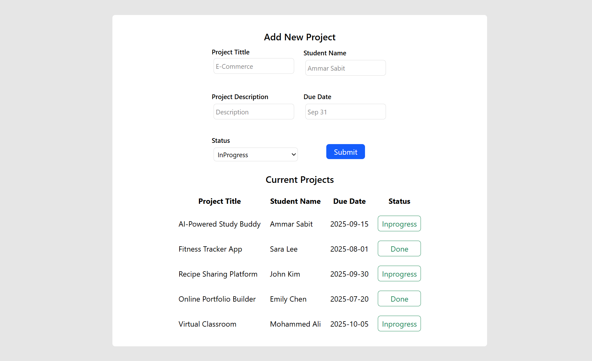
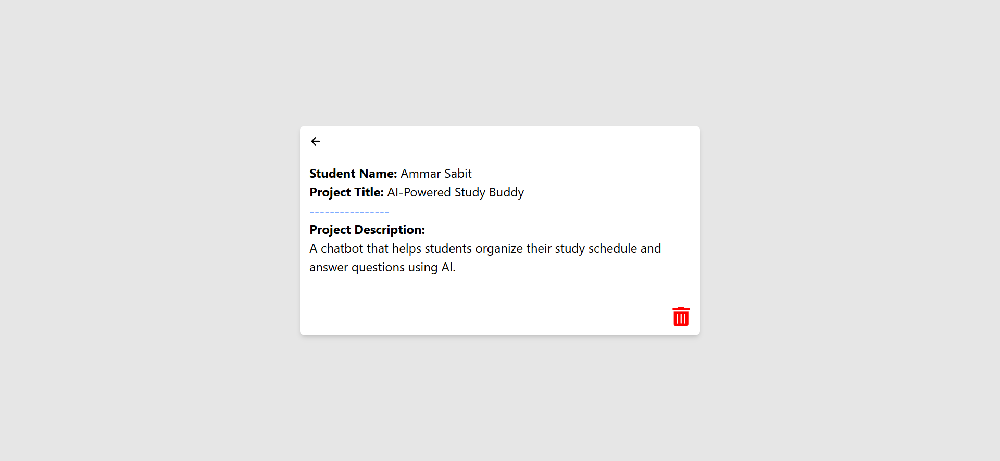

# Bootcamp Project Tracker

This is a MERN stack project (MongoDB, Express, React, Node.js) that showcases the result of my intense fullstack bootcamp experience. It is a full-stack web application to manage and track student projects for bootcamps. Built with React (Vite) for the frontend, Node.js/Express for the backend, and MongoDB for the database.

## Features
- Add, view, and delete student projects
- Toggle project status (in progress / done)
- View project details
- Form validation

## Technologies Used
- **Frontend:** React, TypeScript, Vite
- **Backend:** Node.js, Express
- **Database:** MongoDB
- **Styling:** TailwindCSS
- **API:** RESTful endpoints

## Screenshots

### Home Page


### Project Detail Page


## Getting Started

### Prerequisites
- Node.js (v16+ recommended)
- npm

### Installation

1. **Clone the repository:**
   ```bash
   git clone https://github.com/ammarsabit/Bootcamp-Project-Tracker.git
   cd Bootcamp-Project-Tracker
   ```

2. **Install dependencies:**
   - Backend:
     ```bash
     cd BackEnd
     npm install
     ```
   - Frontend:
     ```bash
     cd ../FrontEnd
     npm install
     ```

### Running the App

1. **Start the backend server:**
   ```bash
   cd BackEnd
   npm start
   ```

2. **Start the frontend dev server:**
   ```bash
   cd ../FrontEnd
   npm run dev
   ```

3. **Open your browser:**
   Visit [http://localhost:5173](http://localhost:5173) (or the port shown in your terminal)

## Folder Structure
```
Bootcamp_Project_Tracker/
├── BackEnd/
│   ├── controllers/
│   ├── models/
│   ├── routes/
│   ├── validators/
│   └── index.js
├── FrontEnd/
│   ├── src/
│   │   ├── components/
│   │   ├── pages/
│   │   ├── services/
│   │   └── App.tsx
│   ├── public/
│   └── index.html
├── package.json
└── README.md
```

## API Endpoints
- `GET /projects` - List all projects
- `POST /projects` - Create a new project
- `GET /projects/:id` - Get project by ID
- `PUT /projects/:id` - Update project status/details
- `DELETE /projects/:id` - Delete a project
